# GitHub Actions Workflows

This directory contains GitHub Actions workflows for automated testing, security scanning, and publishing of Helm charts.

## Available Workflows

### 1. `test.yml` - Basic Chart Testing
**Triggers:** Push to main/develop, Pull requests
**Purpose:** Basic chart testing including linting, unit tests, and template rendering

**Features:**
- Helm chart linting
- Unit tests with helm-unittest
- Template rendering tests
- Workload type testing (Deployment, StatefulSet, Job, CronJob, DaemonSet)
- Chart packaging validation

### 2. `helm-chart-ci.yml` - Comprehensive CI/CD
**Triggers:** Push to main/develop, Pull requests, Manual dispatch
**Purpose:** Comprehensive CI/CD pipeline with security scanning and release management

**Features:**
- All features from `test.yml`
- Security scanning with helm-sec
- Chart packaging and installation testing
- Automated releases for main branch
- Chart repository index management
- Matrix testing for multiple charts

### 3. `k8s-compatibility.yml` - Kubernetes Compatibility Testing
**Triggers:** Push to main/develop, Pull requests, Manual dispatch
**Purpose:** Test chart compatibility across different Kubernetes versions

**Features:**
- Multi-version Kubernetes testing (1.28, 1.29, 1.30)
- Template rendering with different K8s versions
- Workload type compatibility testing
- Feature flag testing (RBAC, HPA, NetworkPolicy)
- Compatibility reports generation
- PR comments with test results

### 4. `publish.yml` - Chart Publishing
**Triggers:** Push to main branch, Tags, Manual dispatch
**Purpose:** Automated chart publishing to GitHub Pages and releases

**Features:**
- Automatic version bumping
- Chart packaging
- GitHub Pages deployment
- GitHub releases creation
- Chart repository index updates
- README generation for chart repository

### 5. `security.yml` - Security Scanning
**Triggers:** Daily schedule, Push to main/develop, Pull requests, Manual dispatch
**Purpose:** Security vulnerability scanning and dependency checks

**Features:**
- Trivy vulnerability scanning
- Helm security scanning
- Hardcoded secret detection
- Resource limit validation
- Security context checks
- Dependency update checks
- Security reports generation

## Usage

### Running Tests Locally

Before pushing changes, you can run the same tests locally:

```bash
# Install helm-unittest plugin
helm plugin install https://github.com/helm-unittest/helm-unittest

# Run the test script
./test-helm.sh
```

### Manual Workflow Triggers

You can manually trigger workflows from the GitHub Actions tab:

1. **Basic Testing:** Go to Actions → "Helm Chart Tests" → "Run workflow"
2. **Comprehensive CI:** Go to Actions → "Helm Chart CI/CD" → "Run workflow"
3. **K8s Compatibility:** Go to Actions → "Kubernetes Compatibility Tests" → "Run workflow"
4. **Security Scan:** Go to Actions → "Security Scan" → "Run workflow"
5. **Publish:** Go to Actions → "Publish Helm Charts" → "Run workflow"

### Workflow Inputs

Some workflows accept inputs when triggered manually:

#### Helm Chart CI/CD
- `chart_path`: Specific chart to test (default: charts/helm-base)
- `test_all_charts`: Test all charts in repository (default: false)

#### Kubernetes Compatibility Tests
- `k8s_version`: Specific Kubernetes version to test (default: latest)

#### Publish Helm Charts
- `chart_version`: Chart version to publish (required)
- `publish_to_gh_pages`: Publish to GitHub Pages (default: true)

## Workflow Dependencies

```mermaid
graph TD
    A[Push/PR] --> B[test.yml]
    A --> C[helm-chart-ci.yml]
    A --> D[k8s-compatibility.yml]
    A --> E[security.yml]
    
    C --> F[publish.yml]
    
    B --> G[Basic Tests]
    C --> H[Comprehensive Tests]
    D --> I[K8s Compatibility]
    E --> J[Security Scan]
    F --> K[Chart Publishing]
    
    G --> L[✅ Pass]
    H --> L
    I --> L
    J --> L
    K --> M[🚀 Released]
```



## Artifacts

Workflows generate various artifacts:

- **Chart Packages:** Packaged Helm charts (.tgz files)
- **Test Reports:** Detailed test results and compatibility reports
- **Security Reports:** Security scan results and recommendations
- **Repository Index:** Updated chart repository index (index.yaml)

## Notifications

- **PR Comments:** Test results and security scan results are automatically commented on pull requests
- **Security Issues:** Failed security scans automatically create GitHub issues
- **Release Notes:** Automated releases include comprehensive release notes

## Configuration

### Environment Variables

- `HELM_VERSION`: Helm version to use (default: 3.17.0)
- `HELM_UNITTEST_VERSION`: helm-unittest plugin version (default: 1.0.1)

### Secrets

No secrets are required for basic functionality. For advanced features like publishing to external repositories, you may need to configure:

- `GITHUB_TOKEN`: Automatically provided by GitHub Actions
- `CHART_REPOSITORY_URL`: For publishing to external chart repositories

## Troubleshooting

### Common Issues

1. **Test Failures:** Check the workflow logs for specific error messages
2. **Security Scan Warnings:** Review the security report and address any issues
3. **Publishing Failures:** Ensure GitHub Pages is enabled and properly configured
4. **K8s Compatibility Issues:** Check if the chart uses deprecated APIs

### Getting Help

1. Check the workflow logs in the GitHub Actions tab
2. Review the generated reports and artifacts
3. Consult the Helm documentation for chart-specific issues
4. Open an issue in the repository for persistent problems

## Best Practices

1. **Always run tests locally** before pushing changes
2. **Review security scan results** regularly
3. **Keep dependencies updated** to avoid security vulnerabilities
4. **Test with multiple Kubernetes versions** before releasing
5. **Use semantic versioning** for chart releases
6. **Document breaking changes** in release notes

## Contributing

When adding new workflows or modifying existing ones:

1. Follow the existing naming conventions
2. Include comprehensive error handling
3. Add appropriate documentation
4. Test workflows thoroughly before merging
5. Update this README with any new features
